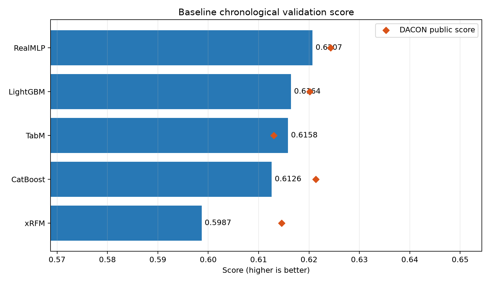
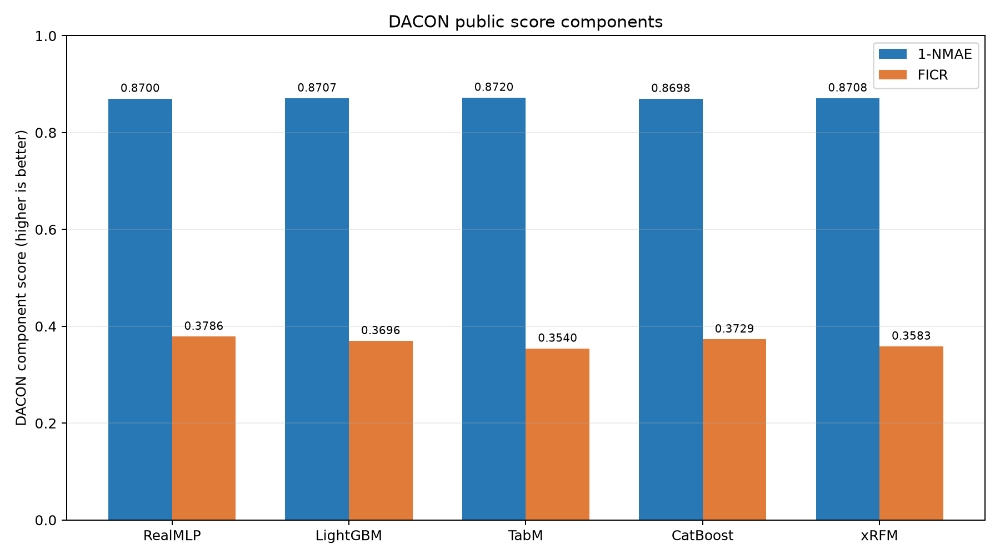

# DACON 풍력 발전량 예측 — Version 2

기상 예보 기반 풍력 발전량 예측 파이프라인입니다. Version 1의 5개 baseline 비교 결과에서 모델별 1-NMAE 차이보다 FICR 차이가 최종 점수를 더 크게 좌우한다는 가설을 얻었습니다. Version 2의 20-epoch 실험 결과 RealMLP을 최종 baseline으로 선정했으며, 현재 200 epoch로 학습 길이를 확장해 검증합니다.

Version 1 코드는 Git tag [v1.0.0](https://github.com/jgi0117/Dacon_Wind_power_forecasting/tree/v1.0.0)에 보존되어 있습니다.

## 1. 프로젝트 개요

기상 예보와 시간 정보를 이용해 2025년의 시간별 풍력 발전량 3개 그룹(kpx_group_1~3)을 예측하는 회귀 프로젝트입니다. Version 2에서는 다음 4개 모델을 동일 조건으로 비교한 뒤 RealMLP을 기준 모델로 결정했습니다.

- LightGBM
- CatBoost
- TabM
- RealMLP

평가식은 다음과 같습니다.

    score = 0.5 × (1-NMAE) + 0.5 × FICR

## 2. 데이터 전처리 방식

원본 데이터는 Git에 포함하지 않습니다. 전처리 결과는 2022-01-01 01:00부터 2025-01-01 00:00까지의 학습 데이터 26,304행과, 2025-01-01 01:00부터 2026-01-01 00:00까지의 테스트 데이터 8,760행으로 구성됩니다.

현재 hybrid 특성 세트는 총 655개입니다.

- 시간: 월·일·시각의 주기형(sin/cos) 특성
- 기상: LDAPS 16개 격자와 GFS 9개 격자의 예보 변수
- 풍속·풍향: 벡터 성분, 풍속의 제곱·세제곱, 고도 간 shear와 비율
- 공간 요약: 격자별 평균·표준편차·최솟값·최댓값과 선택 격자값
- 결측 처리: 동일한 예보 배치와 격자 안에서만 보간하고, 남은 값은 학습 구간 격자 중앙값으로 채우며 결측 표시 특성을 유지
- 타깃: 발전량을 설비용량으로 나눈 capacity factor로 학습하고 예측 후 원 단위로 복원

미래 정보 누수를 막기 위해 예보 생성 시각과 사용 가능 시각을 엄격하게 제한합니다. 원본 데이터와 생성 artifact는 각각 data/, artifacts/에 두며 Git 추적에서 제외합니다.

    .\.venv313\Scripts\python.exe preprocessing.py --data-dir data --output-dir artifacts --mode hybrid

## 3. Version 2 학습 전략

### 시간 순 검증

1. 2023-12-31 14:00 이전 데이터를 모델 학습에 사용합니다.
2. 경계에서 11시간을 purge합니다.
3. 2024년 1~3월을 학습 단계 선택용 validation으로 사용합니다.
4. 2024년 7~12월은 모델 간 최종 비교 구간으로 유지합니다.
5. 선택한 단계 수로 각 타깃의 사용 가능한 전체 과거 데이터를 다시 학습해 테스트를 예측합니다.

세 타깃은 각각 독립적으로 학습합니다. 현재 기본값은 최대 200 epoch 또는 boosting round이며, validation loss가 가장 좋은 단계를 최종 재학습 길이로 사용합니다. --max-epochs로 실행 길이를 변경할 수 있습니다.

### FICR-aware loss

원래 FICR은 capacity-factor 절대오차가 6%와 8% 이내인지에 따라 보상이 계단식으로 바뀌므로 직접 미분할 수 없습니다. Version 2에서는 두 경계를 sigmoid로 근사한 soft-FICR을 사용합니다.

    loss = 0.25 × smooth-MAE + 0.75 × (1-soft-FICR)

기본 FICR 비중은 0.75, sigmoid temperature는 0.01입니다. 명령행의 --ficr-weight와 --ficr-temperature로 변경할 수 있습니다. 실제 competition score도 각 단계마다 함께 기록하지만 모델 선택에는 FICR-aware validation loss를 사용합니다.

| 모델 | FICR 반영 방식 | 기록되는 history |
|---|---|---|
| LightGBM | custom gradient/Hessian objective | round별 train loss, validation loss, score |
| CatBoost | custom objective/evaluation metric | round별 train loss, validation loss, score |
| TabM | PyTorch FICR-aware loss | epoch별 train loss, validation loss, score |
| RealMLP | PyTabKit custom train/validation metric | epoch별 train loss, validation loss, score |

## 4. 실행 방법과 산출물

환경을 구성한 뒤 선정된 RealMLP을 200 epoch로 실행합니다.

    .\scripts\setup_env.ps1
    .\scripts\run_models.ps1 -Models realmlp -Device cpu -PipelineArgs --max-epochs 200

FICR 비중이나 temperature를 변경하는 예:

    .\scripts\run_models.ps1 -Models tabm,realmlp -Device cpu -PipelineArgs --ficr-weight 0.8 --ficr-temperature 0.008

V2 모델별 원본 산출물은 model_outputs/v2/runs/모델명에 저장됩니다. 실행이 끝나면 reports/v2에 다음 파일이 자동 생성됩니다.

- results.csv: 모델별 validation 및 DACON 지표
- group_metrics.csv: 모델·타깃별 지표
- monthly_metrics.csv: 월별 지표
- training_summary.csv: 최적 단계와 학습 시간
- training_history.csv: 모델·타깃·epoch/round별 loss와 score
- figures/training_curves.png: RealMLP 200-epoch train/validation loss 변화
- figures/score_comparison.png: 최종 validation score 비교

## 5. Version 2 모델 선정 결과

| 모델 | 20-epoch validation score | DACON score | DACON 1-NMAE | DACON FICR | 판단 |
|---|---:|---:|---:|---:|---|
| RealMLP | 0.651523 | 0.630536 | 0.856565 | 0.404507 | 최종 baseline 선정 |
| TabM | 0.646692 | 0.621621 | 0.867165 | 0.376078 | 성능 개선 확인 |
| LightGBM | 0.431687 | 미제출 | - | - | 내부 검증 부진 |
| CatBoost | 0.417204 | 미제출 | - | - | 내부 검증 부진 |

LightGBM과 CatBoost는 train/validation 결과가 baseline보다 크게 낮아 DACON에 제출하지 않았습니다. TabM과 RealMLP은 모두 Version 1보다 개선됐으며 RealMLP의 향상이 가장 분명했습니다.

- RealMLP DACON score: 0.624299 → 0.630536, +0.006237
- RealMLP FICR: 0.378593 → 0.404507, +0.025914
- TabM DACON score: 0.613019 → 0.621621, +0.008602
- TabM FICR: 0.353999 → 0.376078, +0.022079

두 모델 모두 FICR은 개선됐지만 1-NMAE는 하락했습니다. 이는 FICR 비중을 높인 loss가 의도대로 동작했다는 신호인 동시에 MAE와의 trade-off가 존재한다는 뜻입니다. 최종 score, FICR 절대값, 모델 안정성을 함께 고려해 RealMLP을 baseline으로 선정했습니다.

다음 실험은 RealMLP만 200 epoch까지 학습합니다. 200개 epoch를 모두 실행하되 FICR-aware validation loss가 가장 낮은 epoch를 최종 재학습 길이로 선택합니다. train/validation loss 그래프도 이 RealMLP 실행만 README와 reports/v2에 사용합니다.

## 6. Version 1 baseline 결과

| 검증 순위 | 모델 | 검증 score | DACON score | DACON 1-NMAE | DACON FICR |
|---:|---|---:|---:|---:|---:|
| 1 | RealMLP | 0.620703 | 0.624299 | 0.870005 | 0.378593 |
| 2 | LightGBM | 0.616430 | 0.620163 | 0.870725 | 0.369600 |
| 3 | TabM | 0.615825 | 0.613019 | 0.872039 | 0.353999 |
| 4 | CatBoost | 0.612603 | 0.621374 | 0.869805 | 0.372943 |
| 5 | xRFM | 0.598697 | 0.614580 | 0.870831 | 0.358329 |

DACON score의 모델 간 범위는 0.01128입니다. 1-NMAE 범위는 0.00223인 반면 FICR 범위는 0.02459였으며, 이 5개 결과 안에서 최종 score와 FICR의 상관계수는 0.999였습니다. 표본 수가 작으므로 Version 2에서는 soft-FICR 학습이 실제 비교 구간과 DACON 점수를 함께 개선하는지 대조해야 합니다.
