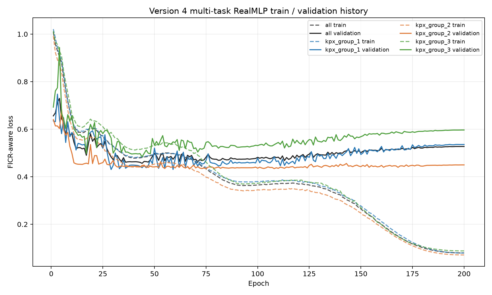

# DACON 풍력 발전량 예측 — Version 4

기상 예보 기반 풍력 발전량 예측 파이프라인입니다. Version 3에서 RealMLP을 200 epoch로 학습하며 LR 0.2, 0.02, 0.002를 비교했습니다. Version 4는 LR 0.02의 multi-task RealMLP에 activity auxiliary objective를 추가해 저출력 관측도 학습 신호로 사용합니다.

- [Version 1 tag](https://github.com/jgi0117/Dacon_Wind_power_forecasting/tree/v1.0.0): 5개 baseline 비교
- [Version 2 tag](https://github.com/jgi0117/Dacon_Wind_power_forecasting/tree/v2.0.0): FICR-aware 모델 비교와 RealMLP 선정
- [Version 3 tag](https://github.com/jgi0117/Dacon_Wind_power_forecasting/tree/v3.0.0): RealMLP 200-epoch learning-rate 비교

## 1. 프로젝트 개요

기상 예보와 시간 정보를 이용해 2025년의 시간별 풍력 발전량 3개 그룹(kpx_group_1~3)을 예측하는 회귀 프로젝트입니다. Version 4의 목표는 그룹별 독립 RealMLP을 shared trunk와 그룹별 prediction head를 갖는 하나의 multi-task 모델로 바꾸는 것입니다.

평가식은 다음과 같습니다.

    score = 0.5 × (1-NMAE) + 0.5 × FICR

## 2. 데이터 전처리 방식

원본 데이터는 Git에 포함하지 않습니다. 전처리 결과는 2022-01-01 01:00부터 2025-01-01 00:00까지의 학습 데이터 26,304행과, 2025-01-01 01:00부터 2026-01-01 00:00까지의 테스트 데이터 8,760행으로 구성됩니다.

현재 hybrid 특성 세트는 총 655개입니다.

- 시간: 월·일·시각의 주기형(sin/cos) 특성
- 기상: LDAPS 16개 격자와 GFS 9개 격자의 예보 변수
- 풍속·풍향: 벡터 성분, 풍속의 제곱·세제곱, 고도 간 shear와 비율
- 공간 요약: 격자별 평균·표준편차·최솟값·최댓값과 선택 격자값
- 결측 처리: 동일한 예보 배치와 격자 안에서만 보간하고, 남은 값은 학습 구간 격자 중앙값으로 채우며 결측 표시 특성을 유지
- 타깃: 발전량을 설비용량으로 나눈 capacity factor로 학습하고 예측 후 원 단위로 복원

미래 정보 누수를 막기 위해 예보 생성 시각과 사용 가능 시각을 엄격하게 제한합니다.

    .\.venv313\Scripts\python.exe preprocessing.py --data-dir data --output-dir artifacts --mode hybrid

## 3. Version 4 학습 전략

### 시간 순 검증

1. 2023-12-31 14:00 이전 데이터를 학습에 사용합니다.
2. 경계에서 11시간을 purge합니다.
3. 2024년 1~3월을 epoch 선택용 validation으로 사용합니다.
4. 2024년 7~12월을 최종 비교 구간으로 유지합니다.
5. 선택된 epoch로 사용 가능한 전체 과거 데이터를 다시 학습해 테스트를 예측합니다.

하나의 shared trunk가 세 그룹의 공통 기상·시간 표현을 학습하고, 3-output prediction layer의 그룹별 head가 각 발전량을 출력합니다. 특정 그룹의 타깃이 없는 행은 해당 그룹 loss에서만 제외하는 target mask를 사용합니다. 따라서 group 1 head는 그룹 2·3의 정답을 직접 입력받지 않지만, shared trunk에 전달되는 gradient를 통해 다른 그룹의 학습 신호를 간접적으로 활용할 수 있습니다.

Version 3에서 train loss 수렴이 가장 안정적이었던 LR 0.02를 기준값으로 고정합니다. 최대 200 epoch를 실행하고 세 그룹의 평균 validation loss가 가장 낮은 epoch를 최종 전체 데이터 재학습 길이로 사용합니다. Version 3와 동일하게 `lr_sched=coslog4`, dropout 0.15, Adam을 유지해 모델 구조 변화의 효과만 비교합니다.

### FICR-aware loss

각 그룹에 대해 FICR의 6%와 8% 오차 경계를 sigmoid로 근사한 soft-FICR을 사용합니다.

    group_loss = 0.25 × smooth-MAE + 0.75 × (1-soft-FICR)
    total_loss = mean(valid group losses)

기본 FICR 비중은 0.75, sigmoid temperature는 0.01입니다. 전체 loss와 함께 그룹별 train loss, validation loss, competition score를 기록해 한 그룹의 개선이 다른 그룹의 악화에 가려지지 않도록 합니다.

### Activity auxiliary objective

기존 capacity loss는 평가 대상인 capacity factor 0.10 이상에서만 계산되어, 학습에 로드된 행 중 약 34.8%는 모든 그룹의 loss가 0이었습니다. Version 4의 최종 실험은 각 그룹이 capacity factor 0.10 이상인지 예측하는 activity logit을 추가합니다.

    train_loss = capacity_loss + 0.15 × activity_BCE

결측 타깃은 `-1` sentinel로 분리하며 activity BCE는 결측을 제외한 실제 0 및 저출력 관측에도 적용합니다. best epoch는 기존 FICR-aware capacity validation loss로만 선택하고, submission에는 세 capacity 출력만 사용합니다.

## 4. 구현 및 산출물

Version 4는 하나의 RealMLP을 한 번 학습해 세 그룹의 capacity와 activity를 동시에 학습합니다. Version 3의 그룹별 독립 학습 코드는 [v3.0.0 tag](https://github.com/jgi0117/Dacon_Wind_power_forecasting/tree/v3.0.0)에 보존되어 있습니다.

현재 전략은 `all-history-masked`입니다. 2022년 행도 학습에 유지해 group 1·2가 shared trunk를 업데이트하고, 정답이 없는 group 3 head의 loss만 제외합니다. 세 타깃이 모두 결측인 행만 학습에서 제거합니다.

    .\scripts\setup_env.ps1
    .\scripts\run_models.ps1 -Models realmlp -Device cpu -PipelineArgs @('--max-epochs','200','--learning-rate','0.02','--activity-loss-weight','0.15')

Version 4 산출물은 기존 결과와 섞이지 않도록 다음 경로를 사용합니다.

    model_outputs/v4/activity_aux_lr_0p02/
    reports/v4/activity_aux_lr_0p02/

- results.csv: 전체 validation 및 DACON 지표
- group_metrics.csv: 타깃별 지표
- monthly_metrics.csv: 월별 지표
- training_summary.csv: 최적 epoch와 학습 시간
- training_history.csv: epoch별 전체·그룹별 train/validation loss와 score
- figures/training_curves.png: 전체·그룹별 train/validation loss 변화

## 5. Version 4 기준선: Version 3 LR 비교

Version 3는 RealMLP을 200 epoch까지 학습하면서 LR만 변경하는 실험입니다. 아래 DACON 점수는 제출 화면의 값을 기록했습니다.

| LR | Validation score | DACON score | DACON 1-NMAE | DACON FICR | 상태 |
|---:|---:|---:|---:|---:|:---|
| 0.2 | 0.653255 | 0.631055 | 0.861265 | 0.400845 | 완료 |
| 0.02 | 0.650715 | 0.625799 | 0.861005 | 0.390592 | 완료 |
| 0.002 | 0.658018 | 0.630061 | 0.859115 | 0.401007 | 완료 |

LR 0.02는 LR 0.2보다 DACON score가 0.005256 낮았습니다. 1-NMAE 차이는 0.000260에 불과하지만 FICR은 0.010253 낮아, 현재 점수 하락은 주로 임계 오차 구간을 반영하는 FICR에서 발생했습니다.

LR 0.002는 가장 높은 validation score를 기록했지만 DACON score는 LR 0.2보다 0.000994 낮았습니다. FICR은 0.000162 높았으나 1-NMAE가 0.002150 낮아 최종 점수에서는 LR 0.2가 가장 좋았습니다. 따라서 이번 세 설정에서는 validation 순위와 DACON 순위가 일치하지 않습니다.

### Epoch별 train/validation loss

| LR | 타깃 | 최저 validation loss (epoch) | 마지막 validation loss | 마지막 train loss |
|---:|:---|---:|---:|---:|
| 0.2 | kpx_group_1 | 0.436019 (39) | 0.500106 | 0.151207 |
| 0.2 | kpx_group_2 | 0.438524 (45) | 0.466366 | 0.132179 |
| 0.2 | kpx_group_3 | 0.500893 (100) | 0.571429 | 0.224855 |
| 0.02 | kpx_group_1 | 0.418604 (66) | 0.524344 | 0.107267 |
| 0.02 | kpx_group_2 | 0.429704 (64) | 0.459624 | 0.085195 |
| 0.02 | kpx_group_3 | 0.479859 (81) | 0.564102 | 0.214852 |
| 0.002 | kpx_group_1 | 0.417816 (152) | 0.459712 | 0.405072 |
| 0.002 | kpx_group_2 | 0.432524 (159) | 0.451317 | 0.360022 |
| 0.002 | kpx_group_3 | 0.493675 (180) | 0.499069 | 0.461288 |

세 LR 모두 train loss가 마지막 epoch까지 감소하므로 수치적으로 발산하지는 않았습니다. LR 0.2와 0.02는 validation loss가 비교적 이른 최저점 이후 다시 상승해 과적합이 나타납니다. LR 0.002는 train loss가 상대적으로 높고 최적 epoch가 152~180으로 늦어 수렴 속도가 느리지만, 200 epoch 안에서 validation loss 최저점에는 도달했습니다. 낮은 validation loss가 DACON 개선으로 이어지지 않은 점은 epoch 선택 구간과 실제 평가 구간 사이의 일반화 차이도 함께 봐야 함을 보여줍니다.

#### LR 0.2

#### LR 0.02

#### LR 0.002

## 6. Version 4 validation 결과

| 구조 | Validation score | 1-NMAE | FICR | 선택 epoch |
|:---|---:|---:|---:|---:|
| Version 3 독립 RealMLP, LR 0.02 | 0.650715 | 0.876935 | 0.424495 | 그룹별 64~81 |
| Version 4 masked multi-task | 0.660839 | 0.880581 | 0.441097 | joint 45 |
| Version 4 + activity auxiliary | 0.666023 | 0.880581 | 0.451466 | joint 44 |

Multi-task는 독립 학습보다 validation score가 0.010124 상승했습니다. 1-NMAE는 0.003646, FICR은 0.016602 상승해 전체적인 오차와 임계 구간 적중률이 모두 개선됐습니다. 특히 group 3는 NMAE가 0.142528에서 0.132280으로 감소하고 FICR이 0.357124에서 0.380157로 상승해 shared trunk의 이득이 가장 컸습니다.

Activity auxiliary는 direct multi-task보다 validation score가 0.005184 상승했습니다. 1-NMAE는 동일하고 FICR이 0.010369 상승했습니다. DACON public score는 `0.632874`로, 1-NMAE `0.864029`, FICR `0.401719`를 기록했습니다. 개선 폭은 작지만 기존에 버리던 저출력 관측을 보조 신호로 활용하는 효과가 확인됐습니다.

| 구분 | 최저 validation loss (epoch) | 해당 epoch train loss | 마지막 train loss | 마지막 validation loss |
|:---|---:|---:|---:|---:|
| 전체 | 0.460531 (45) | 0.494379 | 0.097565 | 0.530212 |
| group 1 | 0.424952 (49) | 0.500290 | 0.098784 | 0.534004 |
| group 2 | 0.423536 (71) | 0.441630 | 0.090668 | 0.462054 |
| group 3 | 0.486385 (19) | 0.658346 | 0.103243 | 0.594578 |

Validation loss는 0.5에서 학습되지 않은 것이 아니라 전체 기준 epoch 45까지 0.460531로 감소한 뒤 다시 상승했습니다. 반면 train loss는 0.097565까지 계속 감소했으므로 주된 문제는 수렴 실패나 결측 mask가 아니라 과적합입니다. joint epoch 45 선택은 정상적으로 동작했습니다. 이번 실험은 validation 비교까지만 사용하며 submission은 생성하지 않습니다.

Activity 실험도 epoch 44에서 capacity validation loss `0.456359`를 기록한 뒤 epoch 200에는 `0.527273`으로 상승했습니다. 같은 기간 train loss는 `0.480889`에서 `0.079315`로 감소해, 보조 학습이 점수를 일부 개선했지만 과적합 자체는 해소하지 못했습니다. 다음 버전에서는 학습 구조를 변경해 과적합 완화를 시도합니다.

