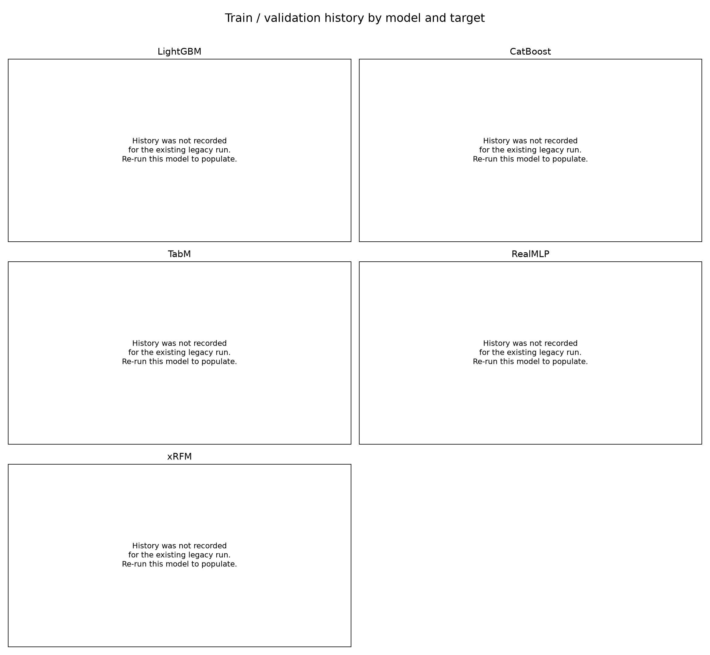

# DACON 풍력 발전량 예측

이 문서는 baseline 의사결정 단계인 **Version 1**을 설명합니다. 프로젝트 개요와 전처리 규약은 이후 버전에서도 공통으로 유지하고, 모델 선택 후의 학습·앙상블 전략은 3절부터 버전별로 갱신합니다.

## 1. 프로젝트 개요

기상 예보와 시간 정보를 이용해 2025년의 시간별 풍력 발전량 3개(kpx_group_1~3)를 예측하는 회귀 프로젝트입니다. 현재 단계의 목적은 동일한 전처리와 시간 순 검증 조건에서 다음 5개 baseline을 비교해 후속 전략의 기준 모델을 정하는 것입니다.

- LightGBM
- CatBoost
- TabM
- RealMLP
- xRFM

모델별 검증 결과와 제출 파일은 독립적으로 생성하며, 비교용 지표는 [reports/baseline](reports/baseline)에 한 번 더 통합합니다. DACON 공개 점수와 구성 지표도 동일한 결과 파일에 보존합니다.

## 2. 데이터 전처리 방식

원본 데이터는 Git에 포함하지 않습니다. 전처리 결과는 2022-01-01 01:00부터 2025-01-01 00:00까지의 학습 데이터 26,304행과, 2025-01-01 01:00부터 2026-01-01 00:00까지의 테스트 데이터 8,760행으로 구성됩니다.

현재 hybrid 특성 세트는 총 655개입니다.

- 시간: 월·일·시각의 주기형(sin/cos) 특성
- 기상: LDAPS 16개 격자와 GFS 9개 격자의 예보 변수
- 풍속·풍향: 벡터 성분, 풍속의 제곱·세제곱, 고도 간 shear와 비율
- 공간 요약: 격자별 평균·표준편차·최솟값·최댓값과 선택 격자값
- 결측 처리: 동일한 예보 배치와 격자 안에서만 보간하고, 남은 값은 학습 구간 격자 중앙값으로 채우며 결측 표시 특성을 유지
- 타깃: 발전량을 설비용량으로 나눈 capacity factor로 학습하고 예측 후 원 단위로 복원

미래 정보 누수를 막기 위해 예보 생성 시각과 사용 가능 시각을 엄격하게 제한합니다. 원본 데이터와 생성 artifact는 각각 data/, artifacts/에 두며 두 디렉터리는 .gitignore에 포함됩니다.

    .\.venv313\Scripts\python.exe preprocessing.py --data-dir data --output-dir artifacts --mode hybrid

## 3. Baseline 학습 전략

무작위 분할 대신 실제 예측 순서를 반영한 시간 순 검증을 사용합니다.

1. 2023-12-31 14:00 이전 데이터를 모델 학습에 사용합니다.
2. 경계에서 11시간을 purge합니다.
3. 2024년 1~3월 구간의 대회 score로 epoch 또는 iteration을 선택합니다.
4. 2024년 7~12월은 baseline 간 최종 비교 전까지 건드리지 않습니다.
5. 선택한 학습 길이로 각 타깃의 사용 가능한 전체 학습 데이터를 다시 학습해 테스트를 예측합니다.

세 타깃은 발전 단지별 관계와 유효 행 수가 다르므로 각각 독립적으로 학습합니다. 선택 지표는 0.5 × (1-NMAE) + 0.5 × FICR이며 높을수록 좋습니다. LightGBM과 CatBoost의 최적화 loss는 MAE, TabM은 MSE, RealMLP는 MAE, xRFM은 kernel-ridge 내부 목적함수입니다. 신경망 모델은 최대 20 epoch, xRFM은 최대 8 iteration을 사용합니다.

환경 구성과 전체 baseline 실행:

    .\scripts\setup_env.ps1
    .\scripts\run_models.ps1 -Models lightgbm,catboost,tabm,realmlp,xrfm -Device cpu

일부 모델만 순서대로 실행할 수도 있습니다.

    .\scripts\run_models.ps1 -Models tabm,realmlp,xrfm -Device cpu

실행이 끝나면 평가 결과가 자동 통합됩니다. 기존 결과만 다시 모으려면 다음 명령을 사용합니다.

    .\.venv313\Scripts\python.exe scripts\build_report.py

## 4. Baseline 평가 결과

| 검증 순위 | 모델 | 검증 score | DACON score | DACON 1-NMAE | DACON FICR |
|---:|---|---:|---:|---:|---:|
| 1 | RealMLP | 0.620703 | 0.624299 | 0.870005 | 0.378593 |
| 2 | LightGBM | 0.616430 | 0.620163 | 0.870725 | 0.369600 |
| 3 | TabM | 0.615825 | 0.613019 | 0.872039 | 0.353999 |
| 4 | CatBoost | 0.612603 | 0.621374 | 0.869805 | 0.372943 |
| 5 | xRFM | 0.598697 | 0.614580 | 0.870831 | 0.358329 |

현재 보존된 baseline 실행은 loss-history 저장 기능을 추가하기 전에 생성되어 epoch별 수치가 없습니다. 따라서 위 곡선에는 임의 값을 만들지 않고 해당 사실을 표시했습니다. 이후 모델을 재실행하면 기록 가능한 train/validation loss가 training_history.csv와 그래프에 자동 반영됩니다. xRFM은 leaf별 재귀 학습 구조라 하나의 전역 train/validation loss 곡선을 제공하지 않습니다.

### 결과 해석과 Version 2 가설

DACON score의 모델 간 범위는 0.01128로 작습니다. 특히 1-NMAE 범위는 0.00223에 불과하지만 FICR 범위는 0.02459이며, 이 5개 결과 안에서는 최종 score와 FICR의 상관계수가 0.999입니다. 표본이 모델 5개뿐이므로 일반화할 수는 없지만, 현재 모델 순위가 사실상 FICR 차이로 결정된다는 근거는 충분합니다.

Version 2에서는 FICR을 더 강하게 반영하되, 계단형인 원래 FICR 자체를 직접 loss로 사용하지 않습니다. 절대오차 6%와 8% 경계를 sigmoid로 근사한 differentiable soft-FICR과 MAE를 결합하고, FICR 비중을 높이는 실험을 우선합니다. 순수 FICR은 경계 밖의 오차 크기를 구분하지 않고 거의 모든 구간에서 gradient가 0이라 학습이 멈추거나 불안정해질 수 있습니다.

통합 산출물:

- [results.csv](reports/baseline/results.csv): 모델별 최종 지표와 DACON 점수 입력 열
- [group_metrics.csv](reports/baseline/group_metrics.csv): 모델·타깃별 지표
- [monthly_metrics.csv](reports/baseline/monthly_metrics.csv): 월별 지표
- [training_summary.csv](reports/baseline/training_summary.csv): 타깃별 최적 학습 길이와 소요 시간
- [training_history.csv](reports/baseline/training_history.csv): 재실행 시 수집되는 epoch/iteration 이력

## 5. 버전 관리 방침

현재 baseline 비교와 의사결정이 끝나면 이 상태를 Version 1 Git tag로 보존합니다. 그 뒤 main은 Version 2 전략으로 진행합니다. Version 2 README는 **1. 프로젝트 개요**와 **2. 데이터 전처리 방식**을 공통으로 유지하고, **3절 이후**를 선택된 모델과 학습·앙상블 전략에 맞게 변경합니다.

아직 baseline 의사결정 전이므로 Version 1 tag는 만들지 않습니다.
