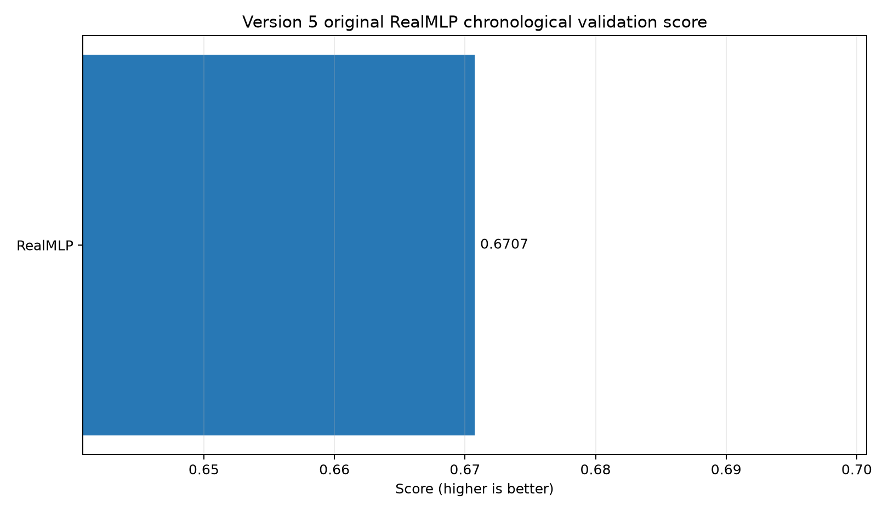
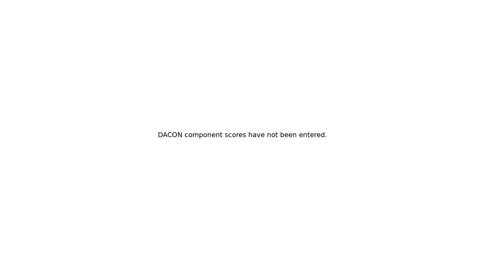
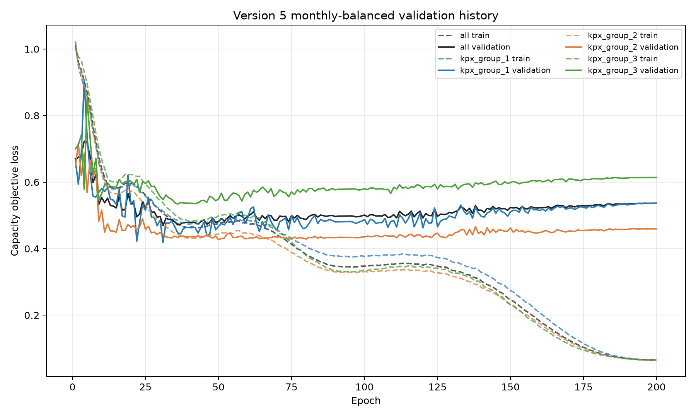
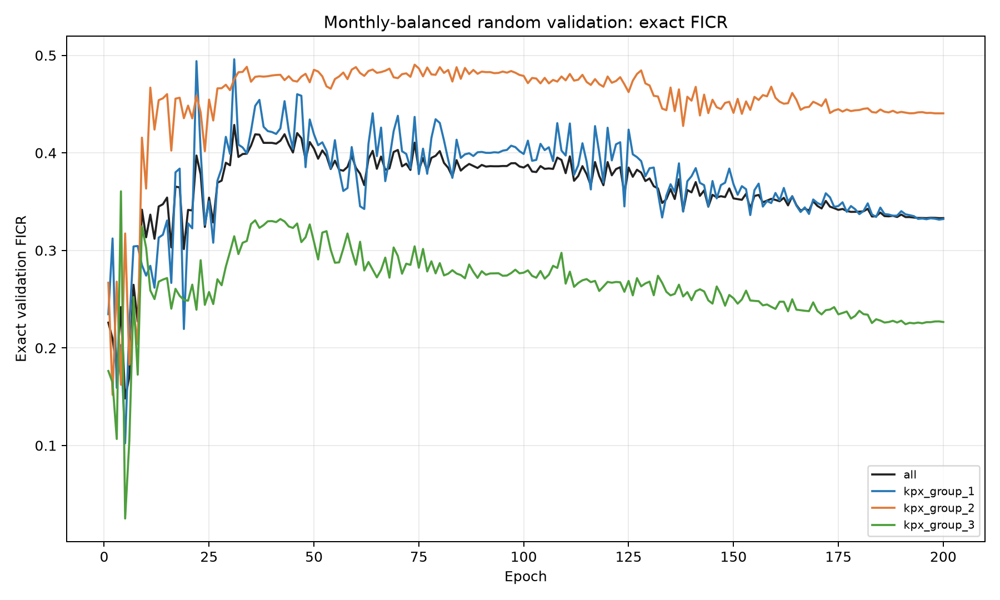

# DACON 풍력 발전량 예측 — Version 5

기상 예보 기반 풍력 발전량 예측 파이프라인입니다. Version 4에서는 multi-task RealMLP에 activity auxiliary objective를 추가해 저출력 관측까지 학습 신호로 활용했습니다. Version 5에서는 현재 시점의 입력만 사용하는 기존 RealMLP에 **Teacher–Student Distillation**을 적용해, 학습 시에만 과거 12시간의 기상·발전량 정보를 간접적으로 활용합니다.

Version 5 최종 결과는 **Validation score 0.670741, DACON score 0.638408**입니다.

* [Version 1 tag](https://github.com/jgi0117/Dacon_Wind_power_forecasting/tree/v1.0.0): 5개 baseline 비교
* [Version 2 tag](https://github.com/jgi0117/Dacon_Wind_power_forecasting/tree/v2.0.0): FICR-aware 모델 비교와 RealMLP 선정
* [Version 3 tag](https://github.com/jgi0117/Dacon_Wind_power_forecasting/tree/v3.0.0): RealMLP 200-epoch learning-rate 비교
* [Version 4 tag](https://github.com/jgi0117/Dacon_Wind_power_forecasting/tree/v4.0.0): multi-task RealMLP + activity auxiliary objective

## 1. 프로젝트 개요

기상 예보와 시간 정보를 이용해 2025년의 시간별 풍력 발전량 3개 그룹(`kpx_group_1~3`)을 예측하는 회귀 프로젝트입니다.

평가식은 다음과 같습니다.

```
score = 0.5 × (1-NMAE) + 0.5 × FICR
```

Version 5는 Version 4의 multi-output RealMLP, FICR-aware loss, activity auxiliary objective를 유지하면서 temporal information을 추가로 학습시키는 것을 목표로 합니다.

학습 데이터는 2022-01-01 01:00부터 2025-01-01 00:00까지 26,304시간이며, Test는 2025년 8,760시간입니다.

현재 모델 입력은 시간 정보와 LDAPS/GFS 기상 예보로 구성됩니다. 실제 Test에서 사용할 수 없는 SCADA와 과거 실제 발전량은 Student의 직접 입력으로 사용하지 않습니다.

## 2. Version 5 학습 전략

Version 4의 RealMLP은 현재 시점의 기상·시간 정보만 입력받습니다. Version 5에서는 과거 발전량과 기상 변화의 temporal pattern을 활용하기 위해 Teacher–Student 구조를 추가했습니다.

Teacher는 학습 단계에서만 다음 정보를 사용합니다.

```
Teacher:
X_t
+ X_(t-1:t-12)
+ y_(t-1:t-12)
```

Student는 학습과 실제 추론 모두 현재 시점 입력만 사용합니다.

```
Student:
X_t → RealMLP → prediction
```

Teacher가 현재 target `y_t` 또는 미래 target을 직접 입력받지 않도록 하며, Teacher prediction은 chronological expanding-window OOF 방식으로 생성합니다. 각 Teacher는 자신이 예측할 구간보다 이전 데이터만 이용해 학습합니다.

생성된 Teacher OOF prediction은 실제 label과 혼합해 Student target으로 사용합니다.

```
y_distilled
  = 0.80 × y_true
  \+ 0.20 × y_teacher
```

Version 5의 기준 distillation teacher weight는 `0.20`입니다. Teacher OOF prediction이 존재하지 않는 구간은 기존 hard target을 그대로 사용합니다.

Teacher는 학습 과정에서만 사용되며 최종 DACON Test에서는 Student만 사용합니다.

```
Training

12h History + Current X
          │
          ▼
       Teacher
          │
          ▼
    OOF Prediction
          │
    hard/soft blend
          │
          ▼
       Student
          ▲
          │
         X_t


Inference

         X_test
            │
            ▼
         Student
            │
            ▼
       Prediction
```

RealMLP의 주요 설정은 Version 4와 동일하게 유지합니다.

* hidden layer: `256 × 3`
* activation: Mish
* dropout: `0.15`
* learning rate: `0.02`
* FICR weight: `0.75`
* activity loss weight: `0.15`
* ensemble: `8`
* Student maximum epoch: `200`
* Teacher epoch: `100`
* Teacher history: `12시간`
* Teacher OOF folds: `4`

Student epoch는 실제 validation target을 기준으로 선택한 뒤, 선택된 epoch로 다시 학습합니다.

실행 예시는 다음과 같습니다.

```
.\scripts\run_models.ps1 `
  -Models realmlp `
  -Device cpu `
  -PipelineArgs @(
    '--max-epochs', '200',
    '--learning-rate', '0.02',
    '--distillation-teacher-weight', '0.20'
  )
```

## 3. Version 5 결과

### Validation 및 DACON 결과

| Model                        | Validation score | Validation 1-NMAE | Validation FICR |  DACON score | DACON 1-NMAE |   DACON FICR |
| :--------------------------- | ---------------: | ----------------: | --------------: | -----------: | -----------: | -----------: |
| Version 4 Activity Auxiliary |         0.666023 |          0.880581 |        0.451466 |     0.632874 |     0.864029 |     0.401719 |
| Version 5 Distilled RealMLP  |     **0.670741** |      **0.887293** |    **0.454189** | **0.638408** | **0.867068** | **0.409749** |

Version 5는 Version 4 대비 Validation score가 약 `+0.00472`, 실제 DACON score가 약 `+0.00553` 상승했습니다.

DACON 결과에서도 1-NMAE가 `0.864029 → 0.867068`, FICR이 `0.401719 → 0.409749`로 모두 개선되어 Teacher–Student Distillation의 효과가 실제 Test에서도 확인됐습니다.

반면 Validation과 DACON 사이에는 약 `0.0323`의 score 차이가 있었으며, 특히 FICR이 `0.454189 → 0.409749`로 상대적으로 크게 감소했습니다.





### 그룹별 Validation 결과

| Group   |   1-NMAE |     FICR |    ≤6% |   6~8% |    >8% |
| :------ | -------: | -------: | -----: | -----: | -----: |
| Group 1 | 0.903347 | 0.515106 | 42.89% | 11.89% | 45.22% |
| Group 2 | 0.892606 | 0.504737 | 40.41% | 10.68% | 48.91% |
| Group 3 | 0.865927 | 0.342724 | 30.35% |  9.36% | 60.28% |

Group 1·2의 FICR은 0.50 이상인 반면 Group 3는 `0.342724`로 낮았습니다.

Group 3는 2022년 target 전체가 결측이어서 Group 1·2보다 실제 target history가 짧습니다. 또한 Group 1·2는 VESTAS V126, Group 3는 UNISON U136으로 터빈 구성이 다릅니다. 현재 모델에서는 Group 3의 2022년 target을 임의로 보간하거나 0으로 채우지 않고 해당 target loss에서 제외합니다.

## 4. 학습 과정

Student epoch selection 과정에서는 약 30 epoch 이후 train loss가 계속 감소하는 반면 validation 성능은 다시 악화되는 과적합이 나타났습니다.

최종 best iteration은 `31`이었으며, 200 epoch는 최종 학습 길이가 아니라 적절한 epoch를 탐색하기 위한 최대 범위입니다.

### Train / Validation Loss



Train loss는 학습이 진행될수록 지속적으로 감소하지만 validation loss는 초반 최저점 이후 다시 증가합니다. 따라서 단순한 장기 학습보다 temporal validation을 이용한 epoch selection이 중요합니다.

### Validation FICR



Validation FICR 역시 초기 구간에서 높은 값을 기록한 뒤 학습 후반으로 갈수록 감소합니다. 평균 오차뿐 아니라 6%·8% 오차 경계 적중률에서도 overfitting이 발생하는 것을 확인했습니다.

## 5. 구현 및 산출물

Teacher–Student Distillation은 다음 파일에서 구현합니다.

```
src/baram/models/distilled_realmlp_model.py
```

주요 기능은 다음과 같습니다.

* 이전 12시간 feature/target history 생성
* chronological Teacher OOF prediction
* Teacher prediction과 hard label blending
* Student epoch selection 및 refit
* Student-only inference

Version 5 주요 산출물:

```
model_outputs/v5/
reports/v5/
```

* `results.csv`: 전체 validation 결과
* `group_metrics.csv`: 그룹별 결과
* `monthly_metrics.csv`: 월별 결과
* `training_summary.csv`: best epoch와 학습 정보
* `training_history.csv`: epoch별 학습 기록
* `validation_predictions.csv`: validation prediction
* `run_report.json`: 실행 configuration 및 metadata
* `submission_realmlp.csv`: DACON 제출 파일

## 6. 결론

Version 5에서는 과거 12시간의 기상 및 실제 발전량을 학습 단계에서만 사용할 수 있도록 Teacher–Student Distillation을 적용했습니다.

Teacher prediction은 chronological OOF 방식으로 생성해 미래 target 정보가 섞이지 않도록 했으며, 최종 Student는 실제 Test와 동일하게 현재 시점의 기상·시간 정보만 사용합니다.

Teacher weight `0.20`을 적용한 결과 Validation score는 `0.670741`, DACON score는 `0.638408`을 기록했습니다. Version 4 대비 Validation과 DACON에서 모두 성능이 향상되어 temporal information을 Student에 간접적으로 전달하는 방식의 효과를 확인했습니다.