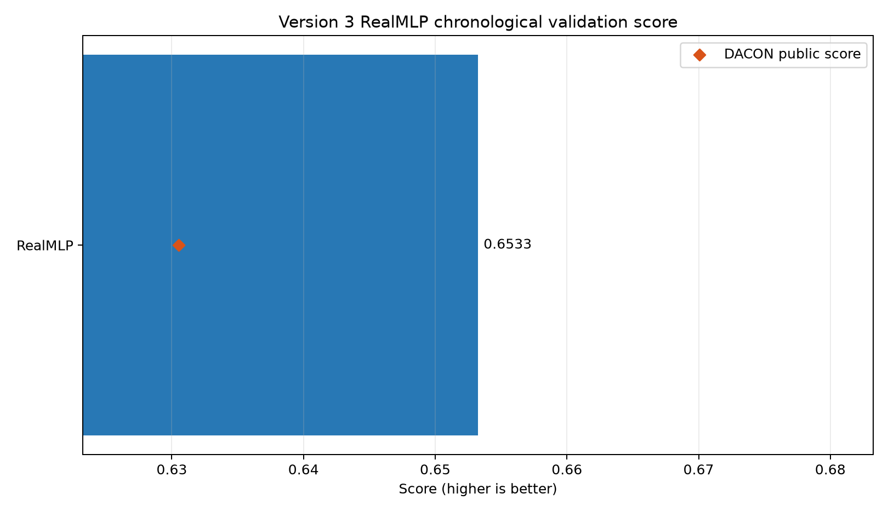
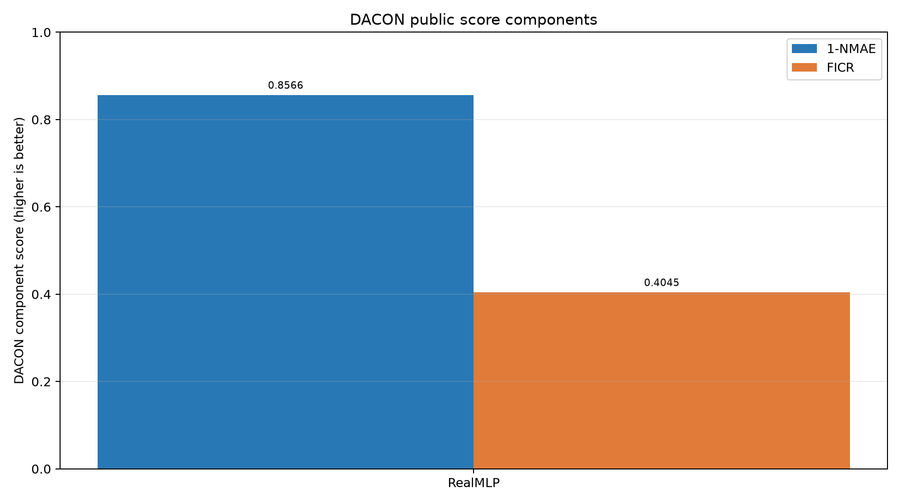

# Version 3 RealMLP results

| Rank | Model | Validation score | DACON score | DACON 1-NMAE | DACON FICR |
|---:|---|---:|---:|---:|---:|
| 1 | RealMLP | 0.653255 | 0.630536 | 0.856565 | 0.404507 |

Entered DACON score components are preserved when this report is rebuilt.
