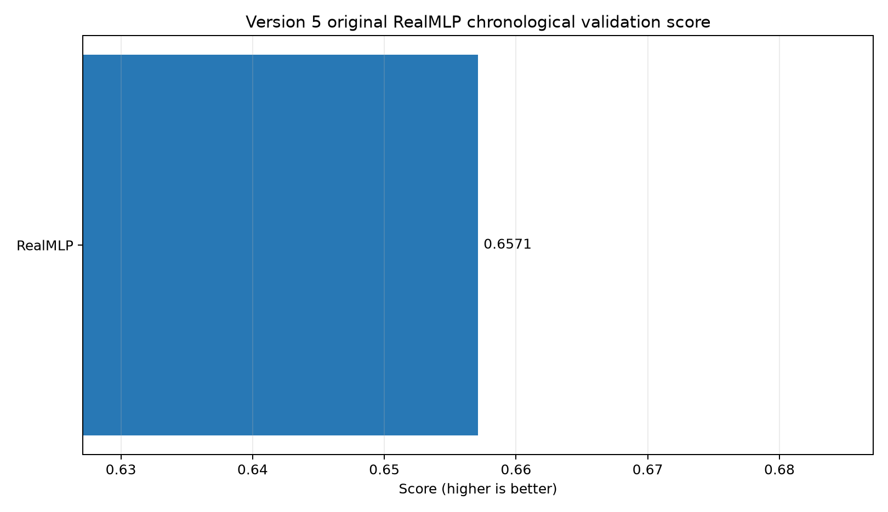
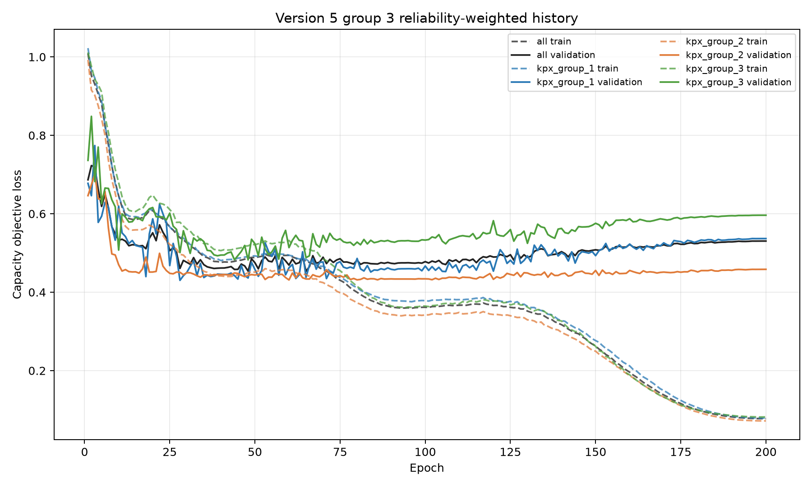
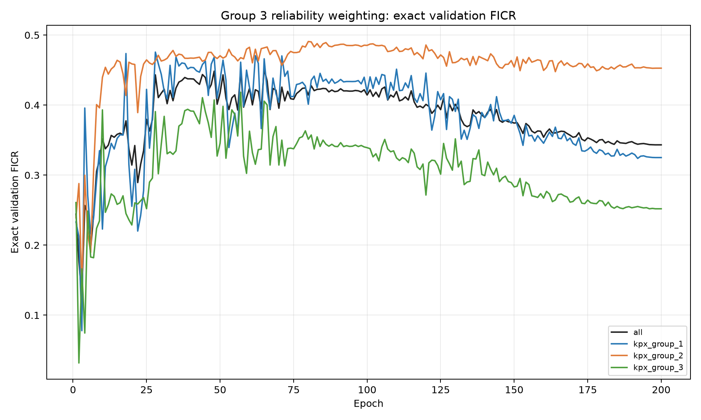

# Version 5 group 3 reliability-weighted RealMLP results

| Rank | Model | Validation score | DACON score | DACON 1-NMAE | DACON FICR |
|---:|---|---:|---:|---:|---:|
| 1 | RealMLP | 0.657119 | - | - | - |

Entered DACON score components are preserved when this report is rebuilt.
