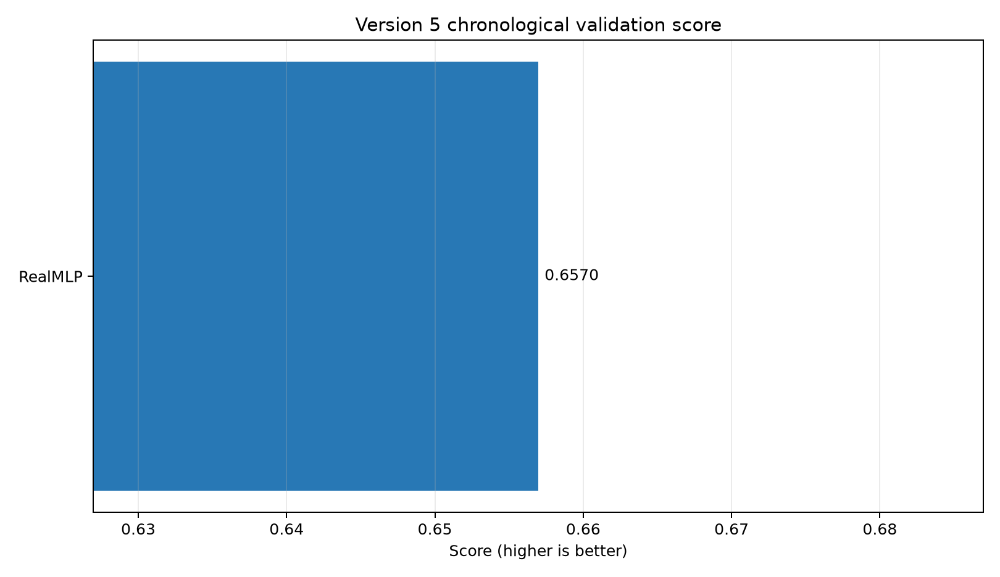
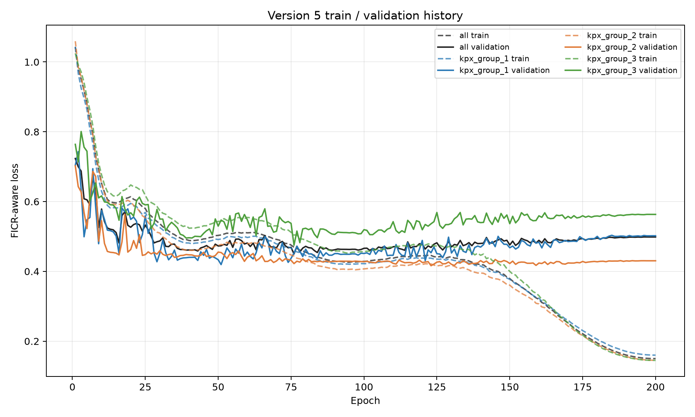

# Version 5 overfitting-mitigation experiment results

| Rank | Model | Validation score | DACON score | DACON 1-NMAE | DACON FICR |
|---:|---|---:|---:|---:|---:|
| 1 | RealMLP | 0.656975 | - | - | - |

Entered DACON score components are preserved when this report is rebuilt.
